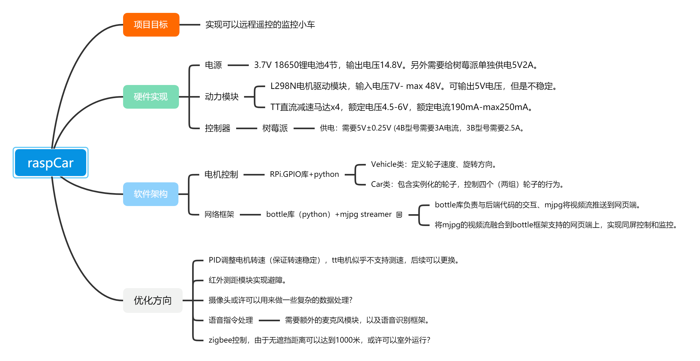

# raspCar

这里是我的树莓派小车项目。

## 项目概览

 

## 任务列表

- [x] 编写小车的驱动逻辑
- [x] 简单的网页控制框架
- [x] 键盘输入监听
- [ ] Zigbee远程遥控/串口通讯
- [ ] 融合视频和控制界面
- [ ] 语音识别模块

***
具体步骤链接
> [我的CSDN博客](https://blog.csdn.net/xuxl97)
